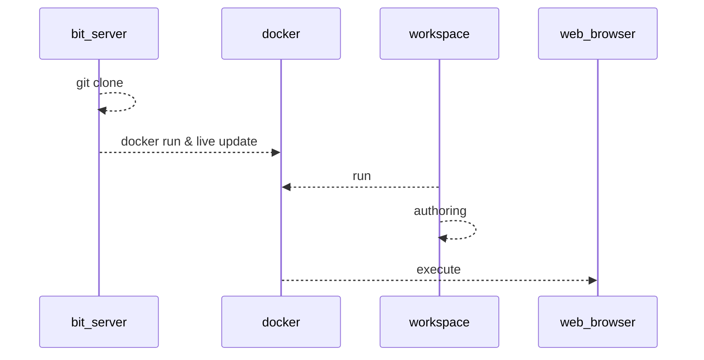
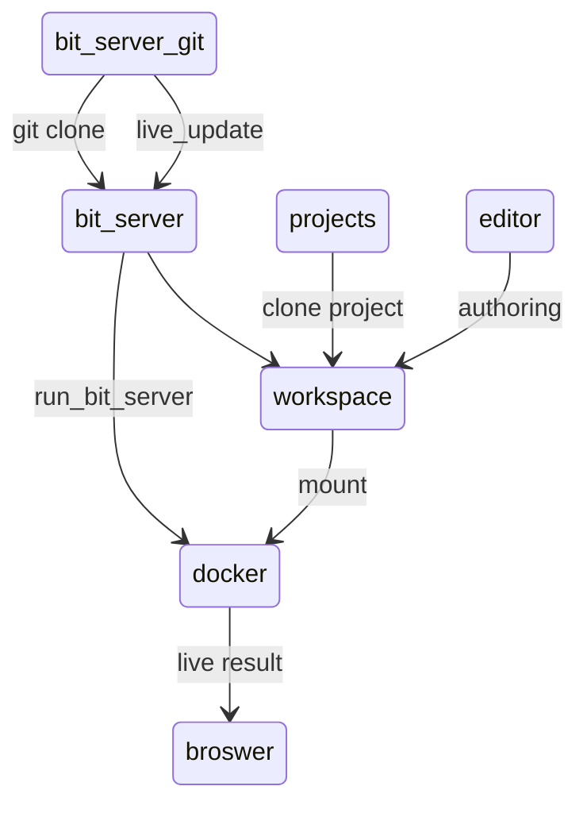

# OS와 무관한 데이터 과학 `개발 환경` 구성


## 컨테이너 기반 환경 구성 

```
Don't reinvent the wheel
```

여러 선배님들과 엔니지어 분들이 이 원칙을  잘 준수하여 준 덕분에 현재 소프트웨어의 생태계(eco system)는 어느때보다 잘 실현이 되었다고 봅니다. 


### 패키지 매니져 

하지만 그로 인한 부작용 역시 있었으니 `dll`, `패키지`가 무수히 많아지고 라이프 사이클이 길어지는 대신 다양한 버젼간의 충돌이 발생하게 되었습니다.

그것을 해소하기 위해 버젼에 대한 의존성과 패키지의 관리를 위한 여러 노력들이 다양한 프로그래밍 환경에 적용되기 시작하였습니다.

### 가상환경 

다양한 환경의 의존성이 있는 프로젝트를 여러개를 진행하는 경우 패키지 매니져를 통해서도 해결할 수 없는 경우가 종종 발생하기 시작하였고 특히, 데이터 과학 분야 쪽은 사용하는 프로젝트 기반의 세대와 발전속도가 비약적으로 증가함에 따라 또다른 방식의 해결방식이 필요하게 되었습니다. 

우리가 자주 사용하는  `conda`, `venv`, `renv` 와 같은 독립환경 구성등이 그 예 라고 할 수 있습니다. 

### 컨테이너 기반 환경 구성 

컨테디너 기반 환경구성의 필요성이 대두된 것은 어제 오늘 일은 아닙니다. 이전에는 `가상머신` 기반의 구성으로 os기반을 확장하였으나 그것이 점차 `컨테이너 기반 방식`으로 변화하게 됩니다. 컴퓨팅 환경의 변화와 맞물린다고 볼 수 있는 점으로 `가상머신`은 낮은 레벨로 내려가고  여러 소프트웨어 패키지 군을 독립적이고 유연하게 구성하고 연계할 수 있는 방식을 채택하고 있는 것으로 판단하여 볼 수 있습니다.  


### 도커 이미지의 재사용 

코드 / 학습 데이터뿐만 아니라 기존 구성한 도커 이미지의 재사용도 여러의미에서 매우 유의미한 방법입니다.  이미지의 재사용을 통해 얻을 수 있는 장점은 다음과 같습니다.

- 적은 시간으로 이미지를 만들 수 있다. 
- 자신만을 위한 이미지 튜닝을 손쉽게 할 수 있다.

처음부터 환경을 구성하는 것도 좋은 생각이지만 안정적인 `수레바퀴`가 있다면 사용해보는 것도 좋겠지요. 기왕이면 official한 이미지를 사용하는 것이 후에 유지보수나 업데이트에도 좋을 것입니다. 

R과 관련된 이미지는 다음과 같습니다. 


ref: running-shiny-server-in-docker

| Parent image    | Parent size (GB) | Final size (GB) | Bild time (min) |
| --------------- | ---------------- | --------------- | --------------- |
| rhub/r-minimal  | 0.035            | 0.222           | 27.0            |
| rocker/r-base   | 0.761            | 1.050           | 2.9             |
| rocker/r-ubuntu | 0.673            | 1.220           | 3.1             |
| rstudio/r-base  | 0.894            | 1.380           | 3.1             |
| rocker/shiny    | 1.380            | 1.610           | 2.3             |

이중에서 우리는 `rocker/shiny`이미지를 기반으로 확장해나갈 것입니다. 


## 무엇을 하기 위해서 인가?

이쪽분야에 접근하다보니 다음과 같은 요구사항이 발생하였습니다.  

- 업무 환경이 항상 동일하지 않다. 
- 작업하던 환경이 유지되면 좋겠다. 
- 배포와 테스트 사이클이 빨랐으면 좋겠다.
- 사소한 변경으로 도커 이미지 생성을 피하고 싶다. 
- 환경과 코드가 통합되었으면 좋겠다. 
- 환경을 세팅하는 방식을 `OS마다` 설명하는 부분을 줄이고 싶다.

 

## 저장소 자체가 개발 환경이 된다 

개발환경과 작업환경을 통합하게되면 

- `협업 환경` 구성이 용이하게 됩니다.  

- 본연의 업무에 집중할 수 있게 됩니다. 


## 어디에 활용하면 좋을까 ?

- 규모가 있는 어플리케이션 패키지 개발 & 배포
- 실습이 용이한 교육환경의 구축 
- 환경 세팅을 최소화한 개발환경의 구성 및 협업


## bit-server

환경을 재구성하는 방법은 앞서 소개한 것과 같이 `가상환경`으로도 충분히 극복할 수가 있습니다. 하지만 소프트웨어의 규모거 더 커지거나 추가 환경을 단일머신에 활용하려다보면 또다른 충돌이 일어나게 됩니다. 대표적인 것으로는`데이터베이스`, `웹서버`등의 솔류션이라고 할 수 있습니다. 

이미 훌륭한 환경이 구성되어있어 어떤 컨테이너를 어떻게 조합하느냐의 문제만 남아있습니다.  여기서 소개하고 싶은 내용은 컨테이너 조합에 대한 부분을 넘어서 `개발 환경`이 곧 `배포 환경`될 수 있도록 구성하고하 하는데 그 의의가 있습니다. 

 ### 포함하고 있는 환경 

- nodejs / php / apache2 / ssh / mysql(mariadb) 
- shiny-server / R and R package 
- qurto / tex / vim 
- python3 / shinylive


## 워크플로우
### 작업 흐름 


### 관계 상태 흐름 



## Docker Desktop 설치하기 

`Docker Desktop`은 windows / mac OS 환경에서 완벽하게 동작합니다.  docker desktop이 있으면 상태나 컨테이너 연결을 빠르고 쉽게 접근할 수 있습니다.  특히 이미지를 실행하여 컨테이너화 할 때 오류등을 찾아낼 때 유용하게 사용할 수 있습니다. 

 아래 링크를 통해 다운로드 하고 설치를 진행합니다. 

```
https://docs.docker.com/desktop/install/mac-install/
https://docs.docker.com/desktop/install/windows-install/
```

`windows os`의 경우 `wsl2`기반으로 운용이 되기 때문에 해당 환경을 반드시 구성하여야 합니다. 

### Docker 사용시 고려사항 

여러개의 OS환경을 동시에 운용할 수 있는 장점이 있는 반면 머신의 리소스를 많이 사용하게 되므로(특히 메모리), 도커 인스턴스의 자원에 대한 설정등을 필요한 만큼 할당하여 사용하도록 관리하는 것이 필요하다는 것을 기억해두시면 좋습니다. 

```
Runtime options with Memory, CPUs, and GPUs
https://docs.docker.com/config/containers/resource_constraints/
```


## Visual Studio Code 설치하기 

visual studio code는 개발환경이 `원격`,`로컬`유무에 따라 내부 확장(extension)을 설치하는 방식이 달라집니다. 특히 원격 개발을 진행할 때에는 자체적으로 visual studio code 서버를 구동 시키며 `ssh` 포트 포워딩을 자동으로 수행하여 줍니다. 

### ssh를 통한 원격 연결 구성 


### bit-server 내려받기

```
git clone https://github.com/joygram/bit-server.git
```

### 프로젝트 연결하기

작업하고자 하는 `git`프로젝트의 저장소와 token 설정을 한다.

```
repository git주소 
respsitory git주소
```


### Docker 포트 개방 및 매핑:

ssh: 원격 개발

웹: 실행환경  

#### basic 
```
apache2 : 80 -> 8080
ssh: 22 -> 4444
```
#### advanced 
```
apache2 : 443 -> 8443
shiny-server : 3838 -> 3939
```

### SSH 연결 

```
ssh shiny@localhost -p 4444
```


## 웹서비스와 통합 

웹서비스와 shiny-server서비스를 `같은 포트`로 서비스하고자 하는 경우 `proxy`와 `rewrite`모듈을 활용하여 연동하여 주도록 합니다. 

이렇게 하였을 때 `여러종류의 웹서비스`를 하나의 통합된 사이트를 통해 연결할 수 있습니다.

### shiny-server와의 통합 

기본 설정은 다음과 같이 되어 있으며 `/shiny/` 로 접근하면 `shiny-server`로 pass해주도록 합니다. shinyApp의 경우 `websocket`을 사용하므로 관련 설정을 함께 포함하여 주어야 합니다. 

```apache
<VirtualHost *:80>
    DocumentRoot /home/bit-server/workspace/html
    ProxyRequests Off
    ProxyPreserveHost On

    # shiny app redirect 
    RewriteEngine on
    RewriteCond %{HTTP:Upgrade} =websocket
    RewriteRule /shiny/(.*) ws://localhost:3838/$1 [P,L]
    RewriteCond %{HTTP:Upgrade} !=websocket
    RewriteRule /shiny/(.*) http://localhost:3838/$1 [P,L]
    ProxyPass /shiny/ http://localhost:3838/
    ProxyPassReverse /shiny/ http://localhost:3838/
    ProxyRequests Off
</VirtualHost>
```

### 웹서버 디렉토리 

기본 웹디렉토리는 `workspace/html` 이하에 두도록 하였습니다. 필요한 html파일이 있다면 그곳에 배포하여 주시면 됩니다. 그외 접근하고자 하는 설정이 있다면 `apache2`설정을 추가하여 설정하여 주시면 됩니다. 


## 테스트 프로젝트  

### shinyApp

- guess_number 

### learnR 

- https://github.com/Public-Health-Scotland/rmarkdown-training-online.git

### quarto

- bit-server quarto site  

- presentation 

### shinyLive 

- shinyelive clone & build


## 도커 환경 `라이브 패치`가 가능하다

`bit-server` git은 도커 이미지를 다시 빌드하지 않고 스크립트 및 설정을 `라이브 패치`가 가능하도록 구성하였습니다.

저장소에 커밋을 하면 재시작시 라이브 패치를 진행합니다.  즉, 최신버젼의 서버 설정 등이 있다면 자연스럽게 반영이 되겠지요. 


### 개인 환경에 맞게 좀 더 커스텀하고 싶다면

#### workspace에 커스텀 설정을 추가합니다. 

현재는 shiny-server와 apache2 서버의 커스텀 설정을 설정할 수 있도록 하였습니다. 

workspcae가 배포환경이라면 배포환경의 workspace에 복사하여 주도록 합니다. 

```
bit-server/workspace/conf/
	shiny-server/
	apache2/
```


#### 저장소를 `fork`하여 기본 저장소 구성 스크립트를 수정하여 줍니다.

라이브 패치가 가능하도록 구성하고 싶다면 `저장소`를 fork하여 구성 스크립트를 수정하여 줍니다.  

```bash
# bit-server/scripts/update_repository.sh
#!/usr/bin/bash
if [ ! -d /home/bit-server ]; then
	echo == git clone == 
	sudo -u shiny git clone https://github.com/joygram/bit-server.git /home/bit-server
else 
	echo == git repository update ==
	pushd .
	cd /home/bit-server
	sudo -u shiny git reset --hard
	sudo -u shiny git pull 
	popd 
fi
```


## workspace의 관리 

### 배포방식을 결정할 수 있다. 

포함시킬수도 있고 외부에서 관리할 수 있습니다. 하나의 컨테이너로 포장하고 싶을 경우에는 기존 Docker파일을 수정 & 확장하여 사용하면 됩니다. 

능동적인 패치를 원하는 경우 이미지 단위 패치가 아니라 `workspace`단위 패치를 수행할 수 있습니다.  


## 컨테이너 관리  

생성한 컨테이너를 지우지만 않으면 기본 환경 구성은 유지가 됩니다. 지속적인 사용이 가능한 것이지요. 

흔한 일은 아니지만 컨테이너를 삭제하는 일은 컴퓨터에 설치한 OS를 제거하는 것과 같은 행위로 추가적인 작업환경을 잃을 수도 있므로 

도커 컨테이너에 추가적인 환경을 유지하고 싶은 경우에는 저장하고 그것을 따로 배포하는 방식의 용도로 사용할 수 있습니다. 

```
docker commit 
```


## Reference 

```
Running Shiny Server in Docker
https://www.r-bloggers.com/2021/06/running-shiny-server-in-docker/
https://github.com/analythium/covidapp-shiny

Running Shiny Server in Docker
https://www.r-bloggers.com/2021/06/running-shiny-server-in-docker/

Shiny on Google Cloud Run - Scale-to-Zero R Web Apps
https://code.markedmondson.me/shiny-cloudrun/

Docker docs 
https://docs.docker.com

Quarto
https://quarto.org
```

