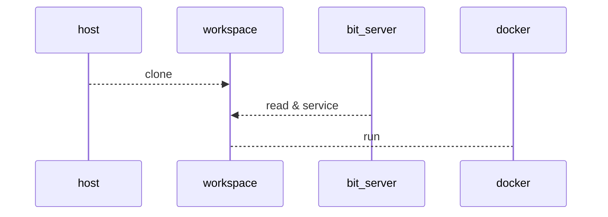

# OS와 무관한 데이터 과학 `개발 환경` 구성

[toc]

## 컨테이너 기반 환경 구성 

```
Don't reinvent the wheel
```

여러 선배님들과 엔니지어 분들이 이 원칙을  잘 준수하여 준 덕분에 현재 소프트웨어의 생태계(eco system)는 어느때보다 잘 실현이 되었다고 봅니다. 


### 패키지 매니져 

하지만 그로 인한 부작용 역시 있었으니 `dll`, `패키지`가 무수히 많아지고 라이프 사이클이 길어지는 대신 다양한 버젼간의 충돌이 발생하게 되었습니다.

그것을 해소하기 위해 버젼에 대한 의존성과 패키지의 관리를 위한 여러 노력들이 다양한 프로그래밍 환경에 적용되기 시작하였습니다.

### 가상환경 

다양한 환경의 의존성이 있는 프로젝트를 여러개를 진행하는 경우 패키지 매니져를 통해서도 해결할 수 없는 경우가 종종 발생하기 시작하였고 특히, 데이터 과학 분야 쪽은 사용하는 프로젝트 기반의 세대와 발전속도가 비약적으로 증가함에 따라 또다른 방식의 해결방식이 필요하게 되었습니다. 

우리가 자주 사용하는  `conda`, `venv`, `renv` 와 같은 독립환경 구성등이 그 예 라고 할 수 있습니다. 

### 컨테이너 기반 환경 구성 

컨테디너 기반 환경구성의 필요성이 대두된 것은 어제 오늘 일은 아닙니다. 이전에는 `가상머신` 기반의 구성으로 os기반을 확장하였으나 그것이 점차 `컨테이너 기반 방식`으로 변화하게 됩니다. 컴퓨팅 환경의 변화와 맞물린다고 볼 수 있는 점으로 `가상머신`은 낮은 레벨로 내려가고  여러 소프트웨어 패키지 군을 독립적이고 유연하게 구성하고 연계할 수 있는 방식을 채택하고 있는 것으로 판단하여 볼 수 있습니다.  


### 도커 이미지의 재사용 

코드 / 학습 데이터뿐만 아니라 기존 구성한 도커 이미지의 재사용도 여러의미에서 매우 유의미한 방법입니다.  이미지의 재사용을 통해 얻을 수 있는 장점은 다음과 같습니다.

- 적은 시간으로 이미지를 만들 수 있다. 
- 자신만을 위한 이미지 튜닝을 손쉽게 할 수 있다.

처음부터 환경을 구성하는 것도 좋은 생각이지만 안정적인 `수레바퀴`가 있다면 사용해보는 것도 좋겠지요. 기왕이면 official한 이미지를 사용하는 것이 후에 유지보수나 업데이트에도 좋을 것입니다. 

R과 관련된 이미지는 다음과 같습니다. 


ref: running-shiny-server-in-docker

| Parent image    | Parent size (GB) | Final size (GB) | Bild time (min) |
| --------------- | ---------------- | --------------- | --------------- |
| rhub/r-minimal  | 0.035            | 0.222           | 27.0            |
| rocker/r-base   | 0.761            | 1.050           | 2.9             |
| rocker/r-ubuntu | 0.673            | 1.220           | 3.1             |
| rstudio/r-base  | 0.894            | 1.380           | 3.1             |
| rocker/shiny    | 1.380            | 1.610           | 2.3             |

이중에서 우리는 `rocker/shiny`이미지를 기반으로 확장해나갈 것입니다. 


## 무엇을 하기 위해서 인가?

여러가지 업무를 수행하다보니 다음과 같은 요구사항이 발생하였습니다.  

- 업무 환경이 항상 동일하지 않다. 
- 작업하던 환경이 유지되면 좋겠다. 
- 배포와 테스트 사이클이 빨랐으면 좋겠다.
- 사소한 변경으로 도커 이미지 생성을 피하고 싶다. 
- 환경과 코드가 통합되었으면 좋겠다. 
- 환경을 세팅하는 방식을 `OS마다` 설명을 해줘야 한다.

그것을 위하여 완전하지는 않지만 `초심자`로써는 만족할 만한 성과를 냈습니다. 

 

## 저장소 자체가 개발 환경이 된다 


저장소가 없으면 clone 있으면 sync를 수행한다.




## bit-server

환경을 재구성하는 방법은 앞서 소개한 것과 같이 `가상환경`으로도 충분히 극복할 수가 있습니다. 하지만 소프트웨어의 규모거 더 커지거나 추가 환경을 단일머신에 활용하려다보면 또다른 충돌이 일어나게 됩니다. 대표적인 것으로는`데이터베이스`, `웹서버`등의 솔류션이라고 할 수 있습니다. 

이미 훌륭한 환경이 구성되어있어 어떤 컨테이너를 어떻게 조합하느냐의 문제만 남아있습니다.  여기서 소개하고 싶은 내용은 컨테이너 조합에 대한 부분을 넘어서 `개발 환경`이 곧 `배포 환경`될 수 있도록 구성하고하 하는데 그 의의가 있습니다. 

 ### 포함하고 있는 환경 

- nodejs / php / apache2 / mysql(mariadb) 
- shiny-server / R and R package 
- qurto / tex / vim 
- python3 / shinylive


도커와 vscode, github을 이용한 구성

- 도커 개발 환경 구성

  - docker desktop 설치 (mac / win)
- github에서 개발환경 클론
- shiny-server 기반 도커 환경
- github에 workspace 만들기
- vscode를 통한 원격환경 구성

  - github계정으로 놀아보자
  - vscode web (github과의 궁합) 확인
- 원격서버에 배포
- 로컬 환경에서 사용
- 원격 개발환경

언제 좋을까?

통합환경 구성 패키지 설치등이 복잡할 때

복잡한 통계 패키지 환경 구성이 필요할 때

개발한 패키지를 컨테이너 단위로 배포하고자 할때


### bit-server 내려받기

```
git clone https://github.com/joygram/bit-server.git
```

### 프로젝트 연결하기

작업하고자 하는 `git`프로젝트의 저장소와 token 설정을 한다.

```
repository git주소 
respsitory git주소
```


### 포트 개방 :

```
3838 -> 3939 
80 -> 8080
443 -> 8443
22 -> 2222
```

### SSH 연결 

```
ssh shiny@localhost -p 2222
```


웹서비스와 통합 

```
<VirtualHost *:9090>
        ServerName bit-server
        ProxyRequests Off
        ProxyPreserveHost On
        
		# shiny app redirect 
        RewriteEngine on
        RewriteCond %{HTTP:Upgrade} =websocket
        RewriteRule /shiny/(.*) ws://localhost:3838/$1 [P,L]
        RewriteCond %{HTTP:Upgrade} !=websocket
        RewriteRule /shiny/(.*) http://localhost:3838/$1 [P,L]
        ProxyPass /shiny/ http://localhost:3838/
        ProxyPassReverse /shiny/ http://localhost:3838/
        ProxyRequests Off
        
        #jupyter
        ProxyPass /api/kernels/ ws://localhost:5000/api/kernels/
    	ProxyPassReverse /api/kernels/ http://localhost:5000/api/kernels/

    	ProxyPass /jupyter/ http://localhost:5000/
    	ProxyPassReverse /jupyter/ http://localhost:5000/
</VirtualHost>
```


## 테스트 프로젝트  

### shinyApp

### learnR 

### quarto 

### shinyLive 

### jupyter 

## workspace의 관리 

### 배포방식을 결정할 수 있다. 

포함시킬수도 있고 외부에서 관리할 수 있습니다. 하나의 컨테이너로 포장하고 싶을 경우에는 기존 Docker파일을 수정 & 확장하여 사용하면 됩니다. 

능동적인 패치를 원하는 경우 이미지 단위 패치가 아니라 `workspace`단위 패치를 수행할 수 있습니다.  

### 같은 환경 여러 환경의 컨테이너가 필요한 경우

 `run` 스크립트를 확장 변경하여 사용하도록 한다. 


## 컨테이너 관리 

생성한 컨테이너를 지우지만 않으면 기본 환경 구성은 유지가 된다. 

따로 생성한 컨테이너를 보관하고 싶은 경우 

```
docker commit 
```

구성한 이미지를 올려서 배포 할 수 있다 


## Reference 

```
Running Shiny Server in Docker
https://www.r-bloggers.com/2021/06/running-shiny-server-in-docker/
https://github.com/analythium/covidapp-shiny

Running Shiny Server in Docker
https://www.r-bloggers.com/2021/06/running-shiny-server-in-docker/

Shiny on Google Cloud Run - Scale-to-Zero R Web Apps
https://code.markedmondson.me/shiny-cloudrun/
```

