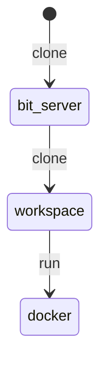

# OS와 무관한 데이터 과학 개발 환경 구성

## bit-server

software 개발환경의 복잡도가 올라감에 따라서 환경의 독립성을 유지 시키면서 개발하려는 구성이

프로그래밍 언어 전반에 걸쳐 정착 단계에 있다고 보여진다.

conda, renv 등이 그 대표적인 것이 되겠다.

심플한 애플리케이션을 개발하고 테스트하고 배포하는 환경은 이미 완벽하리 만큼 잘 구성되어 있다.

하지만 좀 더 규모가 있는 애플리케이션을 개발하고 배포하고자 하거나 독립적인 환경을 구성하고자 할 때는

현재 shiny-app이 가진 특성상 환경 구성을 계획하는데 어려움을 겪는 사례가 종종 보인다.

### 여러 클라이언트 장비를 가지고 접근 개발해야 하는 경우

클라이언트 OS가 각각 달라지는 경우 매번 라이브러리 환경을 구성하고 필요한 툴을 설치하는 과정이 필요하게 된다.

os별로 환경을 구성하는 것도 불편하다.

작업 머신이 노트북 / 데스크톱으로 자주 바뀌는 환경이라면 더욱 그러할 것이다.

도커와 vscode, github을 이용한 구성

- 도커 개발 환경 구성

  - docker desktop 설치 (mac / win)
- github에서 개발환경 클론
- shiny-server 기반 도커 환경
- github에 workspace 만들기
- vscode를 통한 원격환경 구성

  - github계정으로 놀아보자
  - vscode web (github과의 궁합) 확인
- 원격서버에 배포
- 로컬 환경에서 사용
- os와 무관한 원격 개발환경

언제 좋을까?

통합환경 구성 패키지 설치등이 복잡할 때

복잡한 통계 패키지 환경 구성이 필요할 때

개발한 패키지를 컨테이너 단위로 배포하고자 할때

## bit-server 내려받기

```
git clone https://github.com/joygram/bit-server.git
```

포함하고 있는 환경

- nodejs / php / mysql(mariadb) / shiny-server / R and R package / qurto / tex / apache2 / vim / python3 / shinylive

## 프로젝트 연결하기

작업하고자 하는 `git`프로젝트의 저장소와 token 설정을 한다.

```
repository git주소 
respsitory git주소
```

저장소가 없으면 clone 있으면 sync를 수행한다.



- `기본 설정`:

- 포트의 연결:

  ```
  3838 -> 3939 
  80 -> 8080
  443 -> 8443
  22 -> 2222
  ```

  ```
  ssh shiny@localhost -p 2222
  ```

```
conf/넣어 오버라이드 하거나 한다. 
```

```
by default, renv creates project libraries that cannot be moved to a different machine or even user account, due to its reliance on a global cache that sits outside of the project directory. This is exactly the behavior that you want if you're doing local development, but it is problematic for your scenario.

Fortunately, renv includes a solution for this problem. On the development machine, inside the project, call renv::isolate() and this will remove the reliance on the cache. You should then copy the entire project directory, including the project-specific .Rprofile, to the server.

Hope that helps.
```

